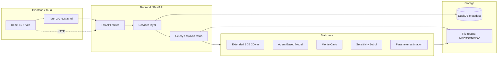

# Архитектура: обзор

## Слои

### Math core (`src/core/`)
Чистый Python + NumPy/SciPy. Не зависит от FastAPI или БД.
- `extended_sde.py` — 20-переменная Эйлер-Маруяма SDE
- `abm_model.py` + `abm_spatial.py` — агентная модель
- `monte_carlo.py` — ансамблевые прогоны (multiprocessing)
- `sensitivity_analysis.py` — Sobol через SALib
- `parameter_estimation.py` — Bayesian inference (PyMC + emcee)

### Data layer (`src/data/`)
- `fcs_parser.py`, `gating.py` — flow cytometry
- `parameter_extraction.py` — `.fcs` → `ModelParameters`

### API (`src/api/`)
- `main.py` — FastAPI app factory
- `routes/` — endpoints (simulate, results, analysis, viz, health)
- `services/` — бизнес-логика, оркестрация задач
- `models/schemas.py` — Pydantic v2 модели

### Storage
- **DuckDB** (`data/regentwin.duckdb`) — метаданные симуляций (id, status, params, ссылки на файлы)
- **Файлы** (`data/results/`) — траектории NumPy в NPZ, экспорт CSV/PNG/PDF

### Frontend (`ui/`)
- React 19 + TypeScript, Vite
- Tauri 2 для desktop-сборки
- Plotly + Three.js для визуализации
- Zustand для state, react-query для API

## Поток данных при запуске симуляции

1. UI → `POST /api/v1/simulate` (mode, params)
2. `simulate.py` → `SimulationService.start(...)` → запись в DuckDB (status=pending)
3. Сервис делегирует в `simulation_tasks` (Celery если включен; иначе asyncio)
4. Воркер вызывает `extended_sde.ExtendedSDEModel.simulate(...)`
5. Прогресс пушится через WebSocket
6. По завершении — траектория пишется в `data/results/<sim_id>.npz`, status=completed
7. UI получает `complete`-событие, делает `GET /api/v1/results/<sim_id>` и рендерит графики
