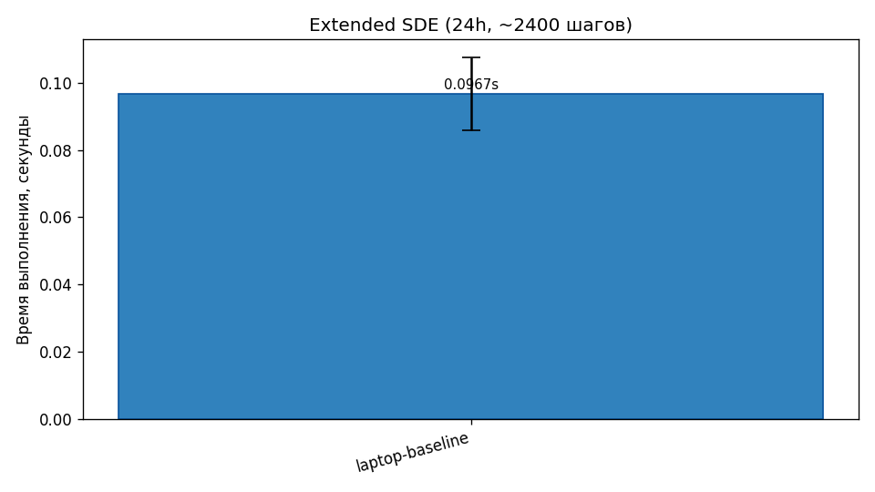
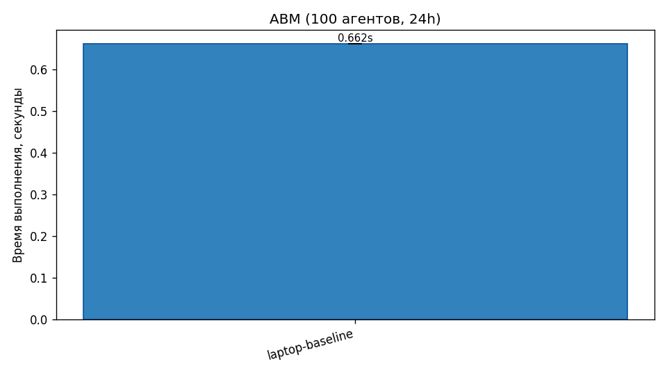
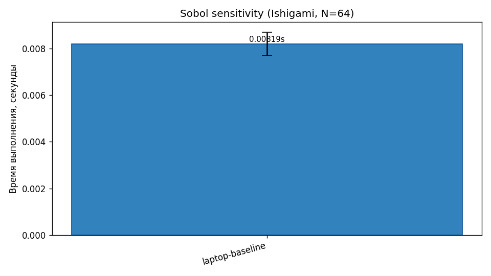

# RegenTwin — Benchmark Report

_Сгенерировано из 1 snapshot(ов) в `output/benchmarks/`._

## System Configurations

| Метка | CPU | Cores | RAM | OS | Python |
|-------|-----|-------|-----|----|--------|
| **laptop-baseline** | Intel(R) Core(TM) i5-8600 CPU @ 3.10GHz | 6/6 | 15.9 GB | Windows-10 | 3.11.14 |

## Benchmark Results

| Группа | laptop-baseline |
|---|---|
| Extended SDE (24h, ~2400 шагов) | 0.0967s ± 0.0109 |
| Extended SDE (72h, ~7200 шагов) | — |
| ABM (100 агентов, 24h) | 0.6617s ± 0.0004 |
| ABM (500 агентов, 24h) | — |
| Monte Carlo serial (4 траектории) | — |
| Monte Carlo parallel (n_jobs=cpu-1) | — |
| Sobol sensitivity (Ishigami, N=64) | 0.0082s ± 0.0005 |

## Графики

